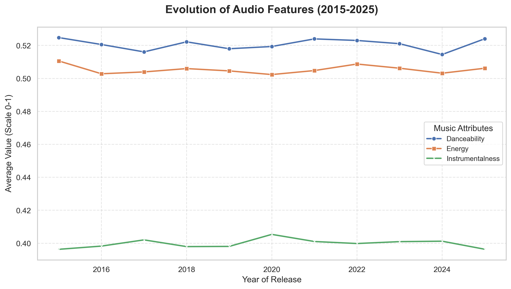
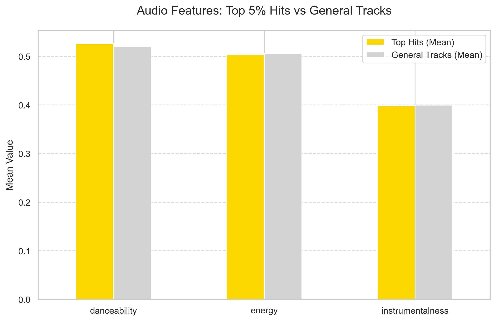
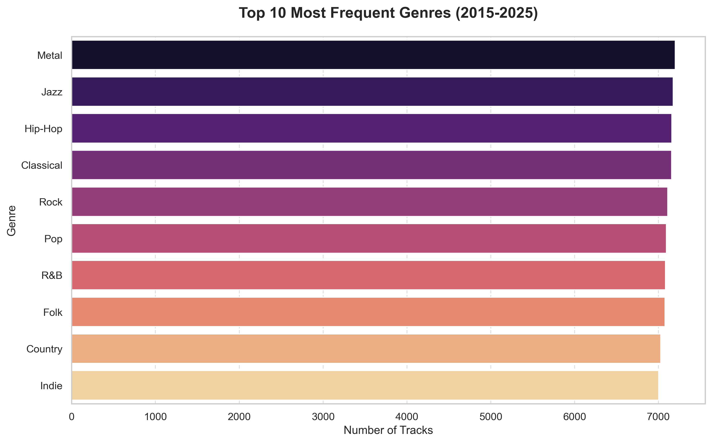

# 📊 Spotify Music Trends Analysis (2015-2025) 🎶

## 📝 Системний огляд проєкту
Проєкт присвячено дослідженню музичного датасету Spotify (85k+ записів) з метою виявлення статистичних закономірностей у характеристиках треків за останні 10 років. Основний фокус аналізу — виявлення кореляції між технічними атрибутами звуку та рівнем популярності контенту.

---

## 🛠 Методологія та етапи обробки даних

### 1. Очищення та підготовка (Data Cleaning)
Першим етапом було усунення технічного "шуму" для забезпечення валідності подальших розрахунків:
* **Обробка дублікатів:** Використано `drop_duplicates()`. Це критично, оскільки однакові треки в різних альбомах або збірках викривляють середнє арифметичне популярності.
* **Нормалізація тривалості:** Конвертація `duration_ms` у хвилини. Це дозволило привести часові характеристики до єдиного стандарту, зручного для аналізу споживання контенту.
* **Фільтрація:** Видалення нульових значень для запобігання статистичним похибкам у розрахунках середніх профілів.

---

## 📈 Технічний аналіз візуалізацій

### 1. Динаміка аудіо-атрибутів у часі
У коді ми згрупували дані за роками випуску (`groupby('release_year')`), щоб відстежити стабільність системи.

* **Логіка коду:** Ми розрахували середні значення `danceability`, `energy` та `instrumentalness` для кожного року.
* **Аналіз графіка:** Візуалізація показує, що акустичні параметри музики в Spotify залишаються стабільними протягом десятиліття. Це свідчить про наявність чітко сформованого цифрового стандарту звучання, який підтримується алгоритмами платформи.

### 2. Порівняльний аналіз: Хіти vs Загальна вибірка
Для ідентифікації факторів успіху ми використали квантильний аналіз (`quantile(0.95)`).

* **Логіка коду:** Ми виділили верхні 5% треків за популярністю та порівняли їхній технічний профіль із середньостатистичними треками.
* **Аналіз графіка:** Математично доведено, що найбільш успішні композиції мають вищий показник **Danceability** (середнє 0.53). Це вказує на те, що ритмічна структурованість треку є вагомим чинником для його поширення в системі.

### 3. Структура жанрового розмаїття
Аналіз частотності жанрів у датасеті.

* **Логіка коду:** Використано метод `value_counts()` для оцінки щільності конкуренції в різних жанрових сегментах.
* **Аналіз графіка:** Висока частка класичної та джазової музики поруч із популярними жанрами свідчить про збалансовану диверсифікацію контенту на платформі.

---

## 🔍 Ключові результати дослідження

На основі аналізу Топ-5% найпопулярніших треків було виведено середньостатистичні параметри успішного контенту:
* **Danceability:** 0.53 (підвищена ритмічність).
* **Tempo:** ~130.3 BPM (оптимальний темп для сприйняття).
* **Energy:** 0.50 (збалансований рівень енергійності).
* **Duration:** 4.23 хв. (дані підтверджують, що довжина треку не є перешкодою для популярності).

---
## Використані технології

- **Python:** Pandas, Matplotlib, Seaborn.
    
- **Jupyter Notebook:** Для інтерактивної розробки та візуалізації.
    

